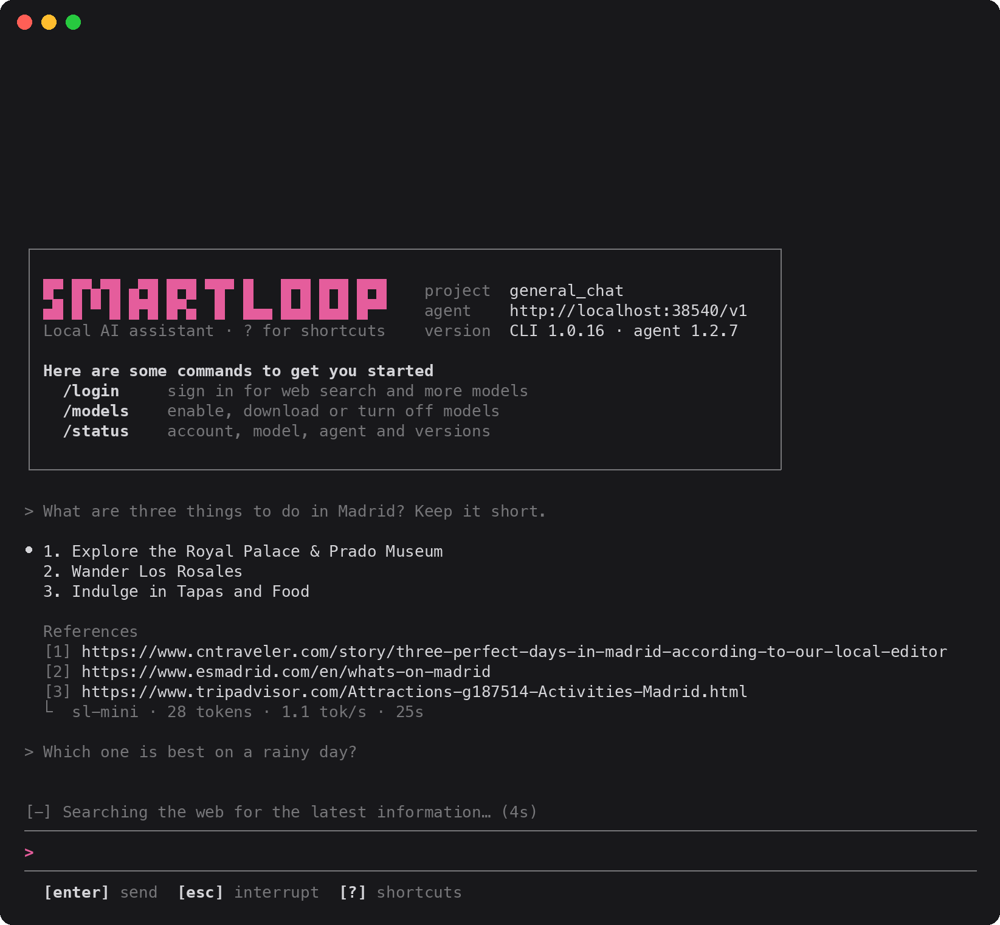

# Smartloop

Smartloop is a local AI orchestration framework for extracting information from your own sources and generating new content. It runs on your device.

The Smartloop command line interface runs Smartloop from your terminal. Chat with the local agent in a full-screen app, search the web, script repeatable workflows, and set up your own local AI infrastructure: the agent, its models, and your projects. If no local agent is running, the CLI downloads the framework and models it needs and starts one itself.



More at:
[docs.smartloop.ai](https://smartloop.ai/docs/intro/)

## Install

macOS and Linux

```sh
curl -fsSL https://smartloop.ai/install | sh
```

Windows (PowerShell):

```powershell
irm https://smartloop.ai/install.ps1 | iex
```

The binary goes to `$CARGO_HOME/bin` (`~/.cargo/bin`) when a Rust toolchain
already owns that directory, since it is on your `PATH` anyway; otherwise to
`~/.local/bin`. If the chosen directory is not on your `PATH`, the installer
appends an export line to the startup file for your shell — `~/.bashrc`,
`~/.zshrc`, or `fish_add_path` in `config.fish` — so a new terminal picks it up.
Re-running the installer will not add that line twice.

On Windows the binary goes to `%USERPROFILE%\.smartloop\bin` and the installer
sets your user `PATH` through the registry. Restart the shell to pick it up.

Set `SMARTLOOP_CLI_INSTALL_DIR` to install elsewhere, or `SMARTLOOP_CLI_VERSION`
to pin a specific release.

Prebuilt binaries are published for Linux (x86_64, aarch64 — statically linked
against musl), macOS (Apple Silicon and Intel) and Windows (x86_64).

### From source

Requires Rust (2024 edition):

```sh
cargo install --path .
```

## Usage

### First run

Any command that talks to the agent starts it when nothing answers on
`http://localhost:38540`. On first use that means:

1. Download SLP framework 1.2.7 from `https://dl.smartloop.ai/slp/1.2.7/` into
   `~/.smartloop/1.2.7/`. Studio desktop uses the same folder and marker files,
   so the two share one install.
2. Start `slp agent start` in the background with `SLP_HOME=~/.smartloop`,
   logging to `~/.smartloop/server.log`. The agent keeps running after the CLI
   exits.
3. Download the embedding model (`bge-m3-Q4_K_M.gguf`, ~417 MB) into the
   workspace's `models/embeddings/` folder for document search.
4. Run the agent's bootstrap, which downloads the default chat model, creates
   the default project and loads the model.

Each step is skipped when its files are already there. Progress shows as a
checklist on stderr under the Smartloop banner that redraws in place, with
the active download's bar in Smartloop pink:

```
[✓] SLP framework 1.2.7                667 MB
[✓] Start agent                    port 38540
[✓] Embeddings (bge-m3)                417 MB
[•] Chat model sl-mini
    ██████████████▋░░░░░░░░░░░░░░░   49%  377 MB/769 MB
[ ] Default project
[ ] Load model
[ ] Skills and connections
```

A step without a bar shows its elapsed time once it runs past a couple of
seconds, and it ends with `✓ Setup complete in 1min 12s`.

When stderr isn't a terminal, each step prints one line as it finishes
instead. `smartloop model enable` shows the same checklist for its download.

To do this up front, or to stop the agent:

```sh
smartloop agent start
smartloop agent stop
```

### Login

```sh
smartloop login
```

Paste your Smartloop token at the prompt (input is hidden). The agent stores it
and uses it for every platform call. The command prints the account it signed
in as, or fails if the token is rejected. Use `--token <token>` or pipe the
token on stdin in scripts. `smartloop logout` clears the stored credentials.

### Projects

List projects:

```sh
smartloop project list
```

Output is rendered as a table showing each project's ID, name, and whether it is a system project.

Create a project from a blank template:

```sh
smartloop project create --name my-project
smartloop project create --name my-project --description "Research notes"
```

A blank project starts with no skills; the service seeds it with the workspace
defaults. Everything the project stores — skills, documents, its index — lives
under the service's own project directory, so there is no working directory to
choose.

Import a project from an archive produced by an earlier export:

```sh
smartloop project create --import my-project.zip
smartloop project create --import my-project.zip --name restored-project
```

`--name` is optional here — pass it to rename the imported project. The import
gets a fresh project ID, and MCP OAuth credentials are stripped from the
archive on the way in.

Delete a project:

```sh
smartloop project delete --id <project-id>
```

Check which endpoint the CLI uses, whether the local agent is running there,
which model it has loaded, and the per-project agents it has started:

```sh
smartloop agent status
```

```
Endpoint: http://localhost:38540
Status:   healthy
Model:    sl-mini (Q4_K_M, 32768 ctx, 769 MB)
Process:  pid 8738, 250 MB
+--------------+------+-------+-------+------+--------+
| Project      | PID  | Port  | Alive | Idle | Memory |
+--------------+------+-------+-------+------+--------+
| general_chat | 2668 | 62110 | true  | 94s  | 122 MB |
+--------------+------+-------+-------+------+--------+
```

`Endpoint` is the URL the CLI talks to (`SMARTLOOP_API_URL`, or the default).
The command exits with status 1 when the agent can't be reached there.

Start an interactive chat with the local agent:

```sh
smartloop run
```

In a terminal this opens a full-screen app, laid out like Claude Code. While
a reply runs, a live status line above the prompt shows the agent's current
step (web search, document lookup, model selection) and for how long, with a
line per running download. The finished reply keeps its sources and the model
that answered:

```
> what is the capital of France?

⏺ Paris is the capital of France.

  References
  [1] https://en.wikipedia.org/wiki/Paris
  ⎿  sl-mini · 7 tokens · 0.4 tok/s · 16s

[-] Reading en.wikipedia.org… (4s)
╭──────────────────────────────────────────────────────────────────────╮
│ >                                                                    │
╰──────────────────────────────────────────────────────────────────────╯
  [enter] send  [esc] interrupt  [?] shortcuts
```

On first use the app shows setup under its banner, as the same checklist,
and opens the chat once the agent is ready. It chats in the server's current project,
or the one given with `--project`. `?` lists the shortcuts. The mouse wheel or
trackpad (or PgUp/PgDn) scrolls the chat, and dragging over it selects text
and copies it to the clipboard when you let go (over SSH, through the
terminal's OSC 52 support). Hold Option (macOS) or Shift (most Linux
terminals) for the terminal's own selection instead. `Ctrl+O` lists the project's models, where Enter
enables one (downloading it first, with its progress in the status pane) or
disables it. Typing `/` lists the commands under the prompt, narrowing
as you type: ↑/↓ picks one, Tab completes it and Enter runs it. Commands: `/login` (paste a
token, masked, to sign in without leaving the chat), `/logout`, `/models`,
`/status` (account, model, agent and versions), `/clear` (clear the chat and start a new session), `/help` and
`/quit`. On exit the session id is printed, to resume with `--session`.

Pass an initial prompt to send immediately:

```sh
smartloop run "what are some things to do in madrid spain?"
```

Options:

```sh
smartloop run --project <project-id>   # chat in this project
smartloop run --session <session-id>   # resume an existing session; a new one is created when omitted
smartloop run --plain                  # line-by-line chat instead of the full-screen app
```

When stdin or stdout isn't a terminal, or with `--plain`, `run` chats line by
line instead: without `--project` it lists your projects and asks which one to
chat in (press Enter for the current one), then keeps reading prompts from
stdin until EOF, `/quit`, `/exit`, `/q`, or `exit`. The response streams token
by token on stdout, and the agent's progress is printed on stderr as
`[step] message` lines, so it doesn't interleave with the answer. When the
answer draws on documents or web pages, the sources it used follow it on
stdout as a numbered list:

```
References
[1] https://releases.rs/
```

### Models

The orchestrator picks which model serves each turn from the models enabled
for the project. List what's available and its state for the current project:

```sh
smartloop model list
```

Enable or disable a model:

```sh
smartloop model enable gemma4-e2b
smartloop model disable gemma4-e2b
```

`enable` downloads the weights first when they aren't on disk yet, showing
progress, and only then switches the model on. Weights are shared across
projects, so each model downloads once. Models marked `(sign in)` need
`smartloop login` first. `disable` also unloads the model from memory. All
three take `--project <project-id>` to act on a project other than the current
one. The `sl-mini` orchestrator is always on and isn't listed.

## Configuration

The CLI connects to the Smartloop API at `http://localhost:38540` by default.
Point it elsewhere with `SMARTLOOP_API_URL`:

```sh
SMARTLOOP_API_URL=http://localhost:9000 smartloop project list
```

With `SMARTLOOP_API_URL` set, the CLI only connects: it never installs or starts
an agent for that URL.

| Variable | Default | Effect |
| --- | --- | --- |
| `SLP_HOME` | `~/.smartloop` | Where the framework, workspace, models and logs live |
| `SLP_PORT` | `38540` | Port the managed local agent listens on |
| `SLP_BASE_URL` | `https://dl.smartloop.ai` | Where the framework archive is downloaded from |

## License

Released under the [MIT License](LICENSE).
